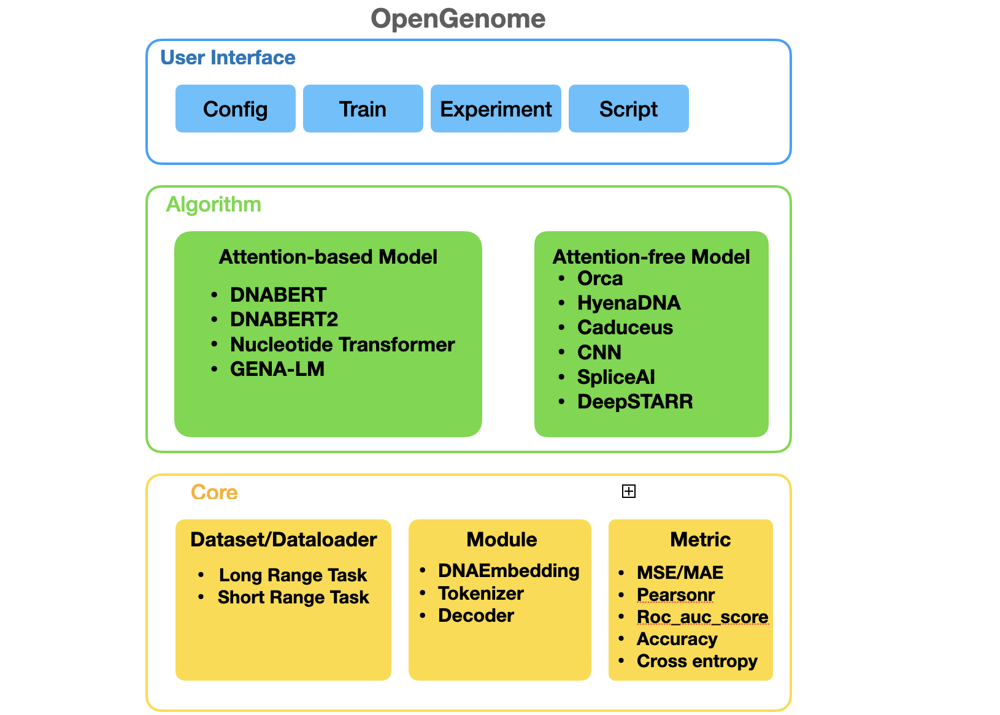
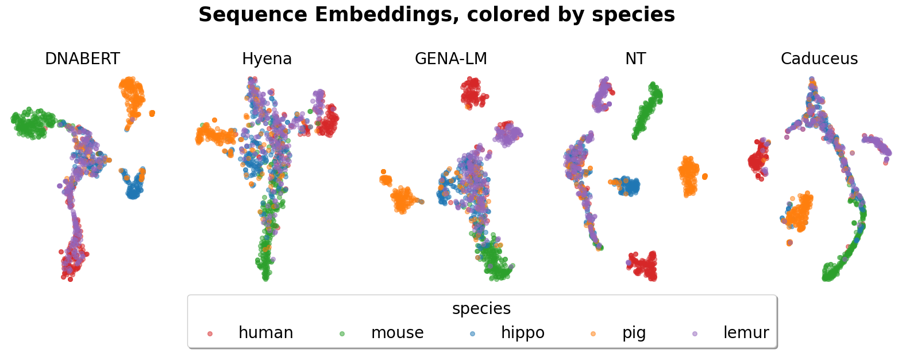
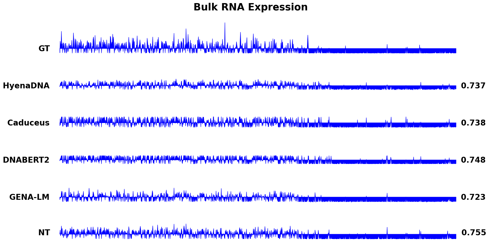
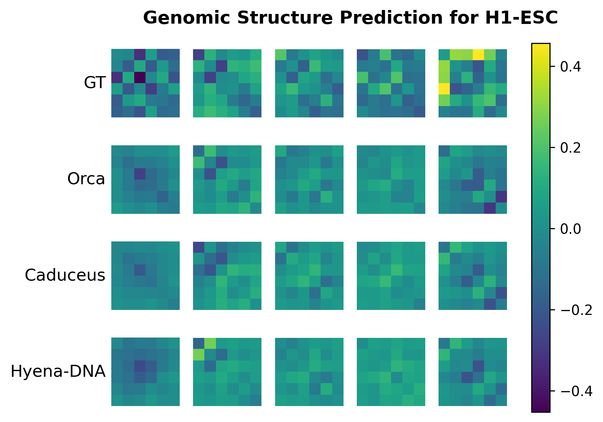
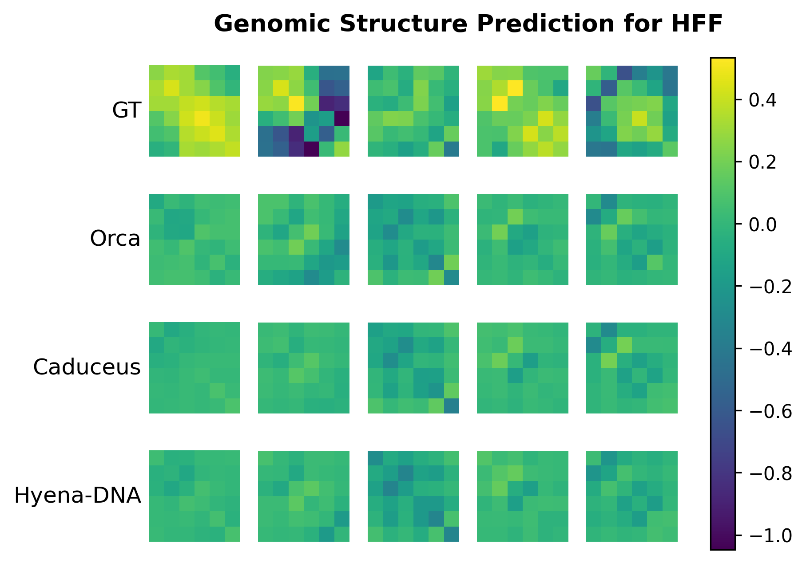
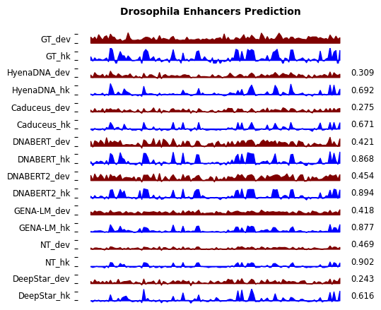

# GenBench: A Comprehensive Benchmark of genomic foundation models


## Introduction

GenBench is a comprehensive benchmark for evaluating genomic foundation model, encompassing a broad spectrum of methods and diverse tasks, ranging from predicting gene location and function, identifying regulatory elements, and studying species evolution. GenBench offers a modular and extensible framework, excelling in user-friendliness, organization, and comprehensiveness. The codebase is organized into three abstracted layers, namely the core layer, algorithm layer, and user interface layer, arranged from the bottom to the top.

<p align="center" width="100%">
  
</p>


<p align="right">(<a href="#top">back to top</a>)</p>

## Overview


</details>

<details open>
<summary>Code Structures</summary>

- `GenBench/configs` contains configuration for benchmark evaluation.
- `GenBench/data` contains datasets.
- `GenBench/notebook` contains analysis and visualization notebooks.
- `GenBench/src` contains source code for evaluation piplines.
- `GenBench/weight` contains pretrained weights for benchmark evaluation.
- `GenBench/experiment` contains scripts for experiment management.


</details>


## Installation

This project has provided an environment setting file of conda, users can easily reproduce the environment by the following commands:
```shell

cd GenBench
conda env create -f environment.yml
conda activate OpenGenome
python setup.py develop
```

<!-- <details close>
<summary>Dependencies</summary>

* argparse
* dask
* decord
* fvcore
* hickle
* lpips
* matplotlib
* netcdf4
* numpy
* opencv-python
* packaging
* pandas
* python<=3.10.8
* scikit-image
* scikit-learn
* torch
* timm
* tqdm
* xarray==0.19.0
</details>

Please refer to [install.md](docs/en/install.md) for more detailed instructions. -->

## Getting Started

Here is an example of single GPU non-distributed training HyenaDNA on demo_human_or_worm dataset.
```shell
bash tools/prepare_data/download_mmnist.sh
python train.py -m train experiment=hg38/genomic_benchmark_mamba \
        dataset.dataset_name=demo_human_or_worm \
        wandb.id=demo_human_or_worm_hyenadna \
        train.pretrained_model_path=path/to/pretrained_model \
        trainer.devices=1
```
## Repeat the experiment
Please see [experiment.MD](experiment/experiment.MD) for the details of experiment management. and find scrips in 'experiment' directory


## Overview of Model Zoo and Datasets

We support various Genomic foundation models. We are working on add new methods and collecting experiment results.

* Spatiotemporal Prediction Methods.

    <details open>
    <summary>Currently supported methods</summary>

    - [x] [HyenaDNA](https://arxiv.org/abs/2306.15794) (NeurIPS'2023)
    - [x] [Caduceus](https://arxiv.org/abs/2403.03234) (Arxiv'2024)
    - [x] [DNABERT](https://academic.oup.com/bioinformatics/article/37/15/2112/6128680) (Bioinformatics'2021)
    - [x] [DNABERT-2](https://arxiv.org/pdf/2306.15006.pdf) (Arxiv'2023)
    - [x] [The Nucleotide Transformer](https://www.biorxiv.org/content/10.1101/2023.01.11.523679v3.abstract) (BioRxiv'2023)
    - [x] [Gena-LM](https://www.biorxiv.org/content/10.1101/2023.06.12.544594v1) (BioRxiv'2023)
   

    

* Genomic foundation models Benchmarks.

    <details open>
    <summary>Currently supported datasets</summary>

    - [x] [Genomic benchmark](https://bmcgenomdata.biomedcentral.com/articles/10.1186/s12863-023-01123-8) (BMC Genomic Data'2023) [[download](https://sites.google.com/berkeley.edu/robotic-interaction-datasets)] [[config](configs/bair)]
    - [x] [GUE](https://arxiv.org/pdf/2306.15006.pdf) (Arxiv'2023) [[download](https://drive.google.com/file/d/1GRtbzTe3UXYF1oW27ASNhYX3SZ16D7N2/view)] [[config](configs/human)]
    - [x] [Promoter prediction](https://basespace.illumina.com/projects/66029966/about) (BioRxiv'2023) [[download](https://www.csc.kth.se/cvap/actions/)] [[config](configs/kth)]
    - [x] [Splice site prediction](https://dl.acm.org/doi/10.1177/0278364913491297) (Cell Press'2019) [[download](https://basespace.illumina.com/projects/66029966/about)] [[config](configs/kitticaltech)]
    - [x] [Drosophila enhancer activity prediction](https://www.nature.com/articles/s41588-022-01048-5) (Nature Genetics'2022) [[download](https://data.starklab.org/almeida/DeepSTARR/Data/)] [[config](configs/kinetics)]
    - [x] [Genomic Structure Prediction](https://www.nature.com/articles/s41588-022-01065-4) (Nature Genetics'2022) [[download](https://github.com/jzhoulab/orca?tab=readme-ov-file)] [[config](configs/mmnist)]
    

    </details>

<p align="right">(<a href="#top">back to top</a>)</p>

## Visualization

We present visualization examples of HyenaDNA below. For more detailed information, please refer to the notebook.

- For species classification task, visualization of t-sne embedding  can be found in [notebook/gene_cluster.ipynb](notebook/gene_cluster.ipynb). 


<!-- | :---: | | -->
<div align=center></div>


- For visualization of Bulk RNA Expression, please refer to [notebook/Bulk_prediction_spearman.ipynb](notebook/Bulk_prediction_spearman.ipynb).


 <div align=center></div> 

- For Genomic Structure Prediction, visualization of predicted structures and ground truth structures are shown in [notebook/plot_genomic_structure_h1esc.ipynb](notebook/plot_genomic_structure_h1esc.ipynb) and [notebook/plot_genomic_structure_hff.ipynb](notebook/plot_genomic_structure_hff.ipynb) after running the experiment.

<div align=center>

</div>

<div align=center>

</div>


 


- for Drosophila enhancer activity prediction, visualization of predicted enhancers and ground truth enhancers are shown in [notebook/drosophila_pearsonr.ipynb](notebook/drosophila_pearsonr.ipynb) after running the experiment.

 <div align=center></div> 

- for analysis of space complexity, please refer to [notebook/count_flops.ipynb](notebook/count_flops.ipynb) and for analysis of length effects and size effects, please refer to [notebook/performance_length.ipynb](notebook/performance_length.ipynb) and [notebook/parameter_size.ipynb](notebook/parameter_size.ipynb) respectively.


## License

This project is released under the [Apache 2.0 license](LICENSE). See `LICENSE` for more information.

## Acknowledgement

The framework of GenBench is insipred by [HyenaDNA](https://github.com/HazyResearch/hyena-dna)

## Contact 

Jiahui Li(jiahuili.jimmy@gmail.com), Westlake University
Zicheng Liu(liuzicheng@westlake.edu.cn), Westlake University


<p align="right">(<a href="#top">back to top</a>)</p>
